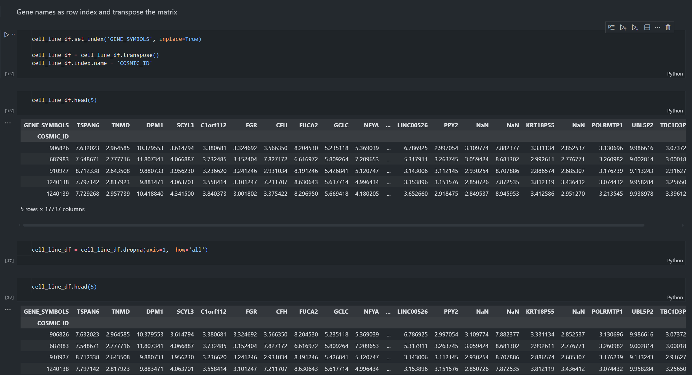
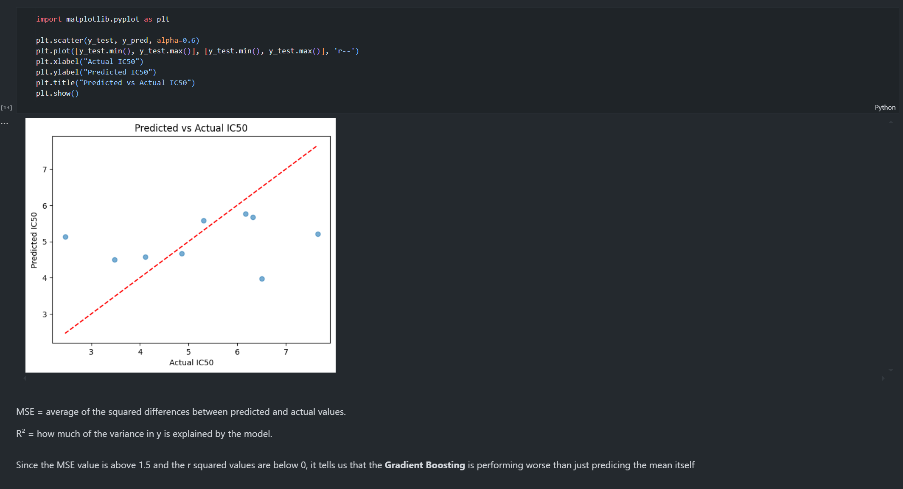
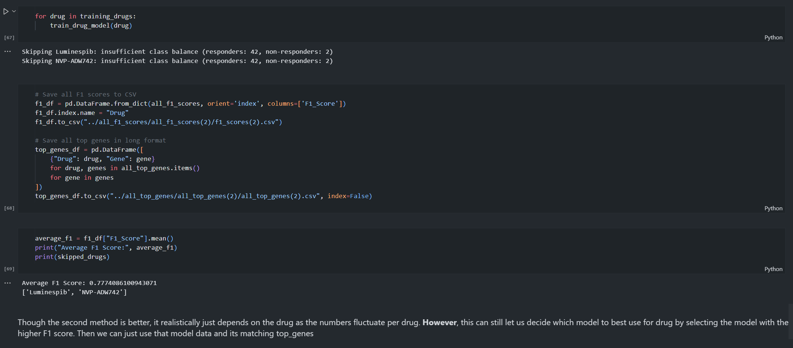

# breast-cancer-response-to-drugs

2 Words - **Personalized Healthcare**. With the future of healthcare expanding thanks to machine learning, I created this project to help learn and utilize these resources to take the first steps to enter the field of bioinformatics. Taking advantage of resources and data provided by **GDSC**, I used breast cancer cell line expression data and created a Logistic Regression Model to learn relationships between expression data and IC50 values in 

## 📖 Table of Contents

- [About](#about)
- [Features](#features)
- [Installation](#installation)
- [Usage](#usage)
- [Project Structure](#project-structure)
- [Examples / Screenshots](#examples--screenshots)
- [Data Reference](#data)

## 🧠 About

The **goal** of this project was to help me take a dive into the world of bioinformatics with a hands on approach. I particularly chose this project since it allowed me to learn how to use new technologies to expand healthcare. I chose to tackle breast-cancer since it affects more than 2.3 million women worldwide (2022 VIA. WHO) and worries even more people who may see symptoms and wish to get some comfort. I made this project to learn the initial steps in helping provide personalized care by utilizing machine learning to determine relationships between breast cancer cells and IC50 values of drugs.

## ✨ Features

Currently, there are models created for 125-127 drugs that are related to the care of breast cancer. These models are saved as 2 different models: model(1) and model(2). Model(1) uses the median IC50 value as the set threshold whereas model(2) takes advantage of KMean-clustering to determine the threshold. The 3 different notesbooks show my process in learning how to preprocess the data as well as reaching issues with trying to train different regression models with the available data. However, each notebook shows the steps I took as well as instances of my thought process of the results and how I could approach certain issues. Additionally, these saved models can then be combined with the top_genes (1 or 2 depending on the model) to then predict whether a cell is a responder or a non-responder to a specific drug.

This logic will be used in the future as I further the project in hopes to create a API to filter this information easily. By using this created API, I hope to then create a visual UI to help make it easier for others to use this information to their benefit. The most important thing I wish to do in the future is to learn to better paramaterize the models to create more effective and accurate models. Currently, the average F1 score for model 1 is around 0.73 and for model 2 is around 0.77. This is the greatest limitation with the model at this time.

## 🛠️ Installation

Clone the repository and install dependencies:

```bash
git clone https://github.com/arnavisharsh/breast-cancer-response-to-drugs.git
cd breast-cancer-response-to-drugs
pip install -r requirements.txt
```

## 🚀 Usage

Run the scripts in order:

**1. Data Preprocessing**
- jupyter notebook 01_data_preprocessing.ipynb

**2. Regression Model**
- jupyter notebook 02_regression_model.ipynb

**3. Classification Model**
- jupyter notebook 03_classification.ipynb


**Outputs:**

**f1_scores.csv** → F1 score per drug.

**top_genes.csv** → top predictive genes per drug.

**skipped_drugs.csv** → drugs skipped due to insufficient data.

## 📂 Project Structure

```bash
BREAST_CANCER_PROJECT/
│
├── all_f1_scores/                  # Model F1 score outputs
│   ├── all_f1_scores(1)/            # Median-threshold method results
│   │   └── f1_scores(1).csv
│   ├── all_f1_scores(2)/            # KMeans-clustering method results
│   │   └── f1_scores(2).csv
│   └── f1_scores.csv                # General results
│
├── all_top_genes/                   # Top genes selected per drug
│   ├── all_top_genes(1)/            # Median-threshold method
│   │   └── all_top_genes(1).csv
│   ├── all_top_genes(2)/            # KMeans-clustering method
│   │   └── all_top_genes(2).csv
│   └── all_top_genes.csv            # General results
│
├── data/
│   ├── processed_data/              # Cleaned datasets used in modeling
│   │   ├── drug_response_data.csv
│   │   └── expression_data.csv
│   └── raw_data/                     # Original raw datasets (empty in screenshot)
│
├── models/                          # Saved trained model files
│   ├── models(1)/                   # Median-threshold models
│   └── models(2)/                   # KMeans-clustering models
│
├── notebooks/                       # Jupyter notebooks for each pipeline step
│   ├── 01_data_preprocessing.ipynb
│   ├── 02_regression_models.ipynb
│   └── 03_classification.ipynb
│
├── top_genes/                       # Top genes CSVs for each drug
│   ├── top_genes(1)/                # Median-threshold method
│   └── top_genes(2)/                # KMeans-clustering method
│
├── .gitignore                       # Files and folders ignored by Git
├── README.md                        # Project documentation
├── requirements.txt                 # Python dependencies
```

(Image folder was also added for the reference images used in the README file)

## 📸 Examples / Screenshots







## 📜 Data Reference

Special thanks to GDSC for the wonderfully laid out resources and data used for the project. The following link is where you can find the data used and other resources.

```bash
https://www.cancerrxgene.org/gdsc1000/GDSC1000_WebResources/Home.html 
```